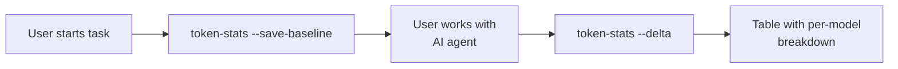

# token-stats

> 🎯 Cross-platform LLM token usage tracker for AI coding agents.

`token-stats` is a CLI tool that tracks **exactly how many tokens and LLM calls** your AI coding agent used per task. It supports **4 major agent frameworks** with a single unified command.

## ✨ Features

- **Per-task statistics**: Not cumulative — tracks exactly what this task consumed
- **Multi-model-aware**: Supports workflows that switch between models mid-session
- **Sub-agent tracking**: Detects Claude Code Explore, OpenClaw sub-tasks, etc.
- **Cross-platform**: Works on macOS, Linux, Windows (pure Python + SQLite + JSON)
- **4 backends supported**:

| Backend | Data Source | Granularity |
|---------|-------------|-------------|
| Hermes Agent | `~/.hermes/state.db` (SQLite) | Session-level cumulative |
| Claude Code | `~/.claude/projects/**/*.jsonl` | Per-message + sub-agent |
| OpenClaw | OpenClaw sessions data (JSON) | Session-level + trajectory |
| CodeX | `~/.codex/state_*.sqlite` | Thread-level cumulative |

- **Auto-detect**: No config needed — just run it
- **Colorful table output**: Per-model breakdown with context warnings

## 🚀 Quick Start

```bash
# 1. Install
pip install token-stats
# Or just download token-stats.py — it's a single file!

# 2. Start a task
token-stats --save-baseline

# 3. Do your work with your AI agent (any model, any number of turns)

# 4. See how many tokens you used
token-stats --delta
```

### Auto-detect Mode

`token-stats` automatically detects which agent framework you're using:

```bash
# List detected backends
token-stats --list-backends

# Validate data integrity
token-stats --validate
```

### Manual Backend Selection

```bash
# Claude Code
token-stats --save-baseline --backend claude-code
token-stats --delta --backend claude-code

# OpenClaw
token-stats --save-baseline --backend openclaw
token-stats --delta --backend openclaw

# CodeX
token-stats --save-baseline --backend codex
token-stats --delta --backend codex
```

## 📊 Output Example

```
┌──────────────────┬───────────────────┬───────────────────┬──────────────────┬───────────┐
│       Model      │      Calls        │    Input Tokens   │   Output Tokens  │   Usage   │
├──────────────────┼───────────────────┼───────────────────┼──────────────────┼───────────┤
│ deepseek-v4-pro  │       2/1,715   │    12,340/1.4M   │     5,678/816K  │  >100%  │
│ claude-sonnet-4  │       1/5       │     8,234/29K    │     3,456/12K   │  14.5%✅│
│ ⬇subagent        │       3/12      │     2,100/48K    │     1,200/28K   │  58.4%✅│
└──────────────────┴───────────────────┴───────────────────┴──────────────────┴───────────┘
 🗂  claude-code · 3/1720 calls · 34,009 tokens · sub-agents: 3/12
 📦  Cumulative: 2,355K/1,048,576 tokens (>100%)
```

**Legend per row (X/Y format):**
| Part | Meaning |
|------|---------|
| **X** (left) | **This task** — tokens/calls since `--save-baseline` |
| **Y** (right) | **Session cumulative** — total from the data file |
| **Usage %** | Context window usage (based on auto-detected model window) |

## ⚙️ How It Works



The tool saves a snapshot of your agent's usage data as a "baseline" when you start a task. When the task ends, it compares current data against the baseline and shows only the **delta** — what was consumed during your task. All data comes from the API provider's returned `usage` object, recorded by the agent framework.

## 🔍 Data Integrity

```bash
# Verify that your agent's data is complete and accurate
token-stats --validate
```

This checks:
- Database/file existence
- Token data is reasonable (non-negative, non-zero when there are API calls)
- All required fields are populated

## 🐛 Supported Models (Context Window Auto-Detect)

| Family | Models | Window |
|--------|--------|--------|
| DeepSeek | v4-flash, v4, chat, reasoner | 1,048,576 (1M) |
| OpenAI | GPT-4o, GPT-4o-mini, o1, o3, o4-mini | 128K ~ 1M |
| Anthropic | Claude Sonnet/Opus/Haiku 3/4 | 204,800 (200K) |
| Google | Gemini 2.5 Pro, 2.0 Flash, 1.5 Pro | 1M ~ 2M |
| Qwen | Qwen3, 3.6, Max, Plus, Turbo | 128K ~ 1M |
| Others | Llama 3.1, Mistral Large, Mixtral | 8K ~ 128K |

Unrecognized models default to 128K. The model map is extensible — contributions welcome!

## 📦 As a Hermes Skill

`token-stats` can also be installed as a [Hermes Agent](https://github.com/nousresearch/hermes-agent) skill:

```bash
# In Hermes, just run:
token-stats --save-baseline   # At task start
token-stats --delta            # At task end
```

The `SKILL.md` in this repo provides full Hermes integration with automatic post-task reporting.

## 🔧 Requirements

- Python 3.10+
- No external dependencies (stdlib only: `sqlite3`, `json`, `os`, etc.)
- One of: Hermes Agent / Claude Code / OpenClaw / CodeX

## 📄 License

MIT

## 🤝 Contributing

PRs welcome! Especially:
- Adding model context windows
- New backend adapters
- Localization
- Bug reports
